# Sheets-Compose-Dialogs

<p>

  

  <p>

An Android library that offers dialogs & views for various use cases - build with Jetpack Compose. All of the dialogs & views are easy and quick to implement. Views can be used for PopUps, BottomSheets and other containers.

   <a href="https://search.maven.org/search?q=g:%22com.maxkeppeler.sheets-compose-dialogs%22">
     
   </a>

  <a href="https://github.com/maxkeppeler/sheets-compose-dialogs/actions/workflows/main.yml/badge.svg">
  
  </a>

   <a href="https://www.codacy.com/gh/MaxKeppeler/sheets-compose-dialogs/dashboard?utm_source=github.com&amp;utm_medium=referral&amp;utm_content=maxkeppeler/sheets-compose-dialogs&amp;utm_campaign=Badge_Grade">
     
   </a>

<a href="https://github.com/maxkeppeler/sheets-compose-dialogs">
  
</a>

<a href="https://github.com/maxkeppeler/sheets-compose-dialogs/fork">
  
</a>

<a href="https://github.com/maxkeppeler/">
  
</a>

<a href="https://twitter.com/intent/tweet?text=Checkout%20this%20beautiful%20library!%20%23android%20%23androiddev%20%23library%20%40maxkeppeler%20%0A%0Ahttps%3A%2F%2Fgithub.com%2Fmaxkeppeler%2Fsheets-compose-dialogs">
  
</a>

<a href="https://twitter.com/max_keppeler">
  
</a>


# Get started
The library contains various use-cases. Each module represents one use-case and contains a `*Dialog` and `*View`. You can use the `*Dialog` directly while you can use the `*View` for bottom sheets, popups and other non-scrollable containers.

Play around with the samples via [APK](https://github.com/maxkeppeler/sheets-compose-dialogs/blob/main/app/sample.apk).

In your top-level `build.gradle`

```gradle
repositories {
  ...
  mavenCentral()
}
```

In your app `build.gradle` file:

```gradle
dependencies {
  ...
  // Implementing the `core` module is mandatory for using other use cases.
  implementation 'com.maxkeppeler.sheets-compose-dialogs:core:<version>' 
  implementation 'com.maxkeppeler.sheets-compose-dialogs:<module>:<version>'
}
```
Replace `<version>` with the (latest or preferred) version of the library.
</br>
Replace `<module>` with the module you want to use.
</br>
Modules: `core` | `info` | `color` | `calendar` | `rating` | `clock` | `duration` | `date-time` | `option` | `list` | `input` | `emoji` | `state`  
</br>
📖 Get a better insight into the API ‏‏‎ ‎‣‏‏‎ ‎ 
[API Documentation](https://maxkeppeler.github.io/sheets-compose-dialogs/api/)
</br>
✨ General documentation, resources and more ‏‏‎ ‎‣‏‏‎ ‎
[Documentation](https://maxkeppeler.notion.site/sheets-compose-dialogs-804f0ebcb2c84b98b7afa5f687295aed)

# Showcase
Take a look at the use-cases presented as dialogs. These same use-cases can also be displayed within a popup, bottom sheet, or any other container view.
</br>
</br>

<!-- AUTO-GENERATED-SAMPLES-CONTENT:START -->
<h2>Calendar</h2>
Module <code>calendar</code> ‎‎ | ‎‎ <a href="https://maxkeppeler.github.io/sheets-compose-dialogs/api/calendar/index.html" title="Module Documentation">API Documentation</a>
</br>
</br>
<table style="border: none;">
<tr>
<th style="text-align: center;">Light</th>
<th style="text-align: center;">Dark</th>
<th style="text-align: center;"></th>
<th style="text-align: center;"></th>
</tr>
<tr>
<td width="25%"> <a style="text-align: center" href="https://github.com/maxkeppeler/sheets-compose-dialogs/blob/main/app/src/main/java/com/mk/sheets/compose/samples/CalendarSample1.kt" title="Code">CalendarSample1</a>
 </br>
 </td>
<td width="25%"> <a href="https://github.com/maxkeppeler/sheets-compose-dialogs/blob/main/app/src/main/java/com/mk/sheets/compose/samples/CalendarSample1.kt" title="Code">CalendarSample1</a>
 </br>
</td>
<td width="25%"> </td>
<td width="25%"> </td>
</tr>
<tr>
<td width="25%"> <a style="text-align: center" href="https://github.com/maxkeppeler/sheets-compose-dialogs/blob/main/app/src/main/java/com/mk/sheets/compose/samples/CalendarSample2.kt" title="Code">CalendarSample2</a>
 </br>
 </td>
<td width="25%"> <a href="https://github.com/maxkeppeler/sheets-compose-dialogs/blob/main/app/src/main/java/com/mk/sheets/compose/samples/CalendarSample2.kt" title="Code">CalendarSample2</a>
 </br>
</td>
<td width="25%"> </td>
<td width="25%"> </td>
</tr>
<tr>
<td width="25%"> <a style="text-align: center" href="https://github.com/maxkeppeler/sheets-compose-dialogs/blob/main/app/src/main/java/com/mk/sheets/compose/samples/CalendarSample3.kt" title="Code">CalendarSample3</a>
 </br>
 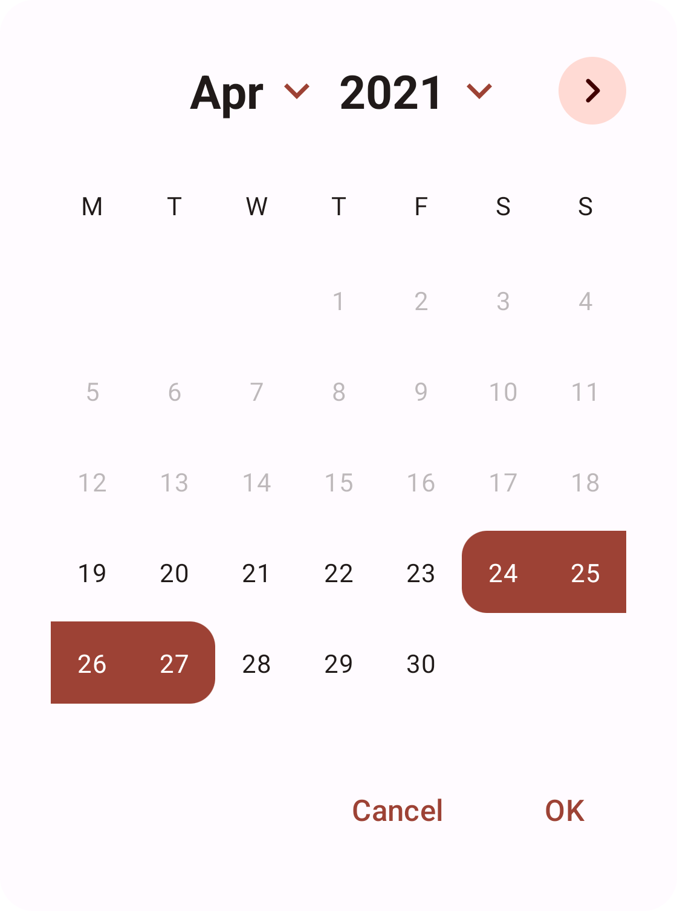</td>
<td width="25%"> <a href="https://github.com/maxkeppeler/sheets-compose-dialogs/blob/main/app/src/main/java/com/mk/sheets/compose/samples/CalendarSample3.kt" title="Code">CalendarSample3</a>
 </br>
</td>
<td width="25%"> </td>
<td width="25%"> </td>
</tr>
</table>
</br>


<h2>Clock</h2>
Module <code>clock</code> ‎‎ | ‎‎ <a href="https://maxkeppeler.github.io/sheets-compose-dialogs/api/clock/index.html" title="Module Documentation">API Documentation</a>
</br>
</br>
<table style="border: none;">
<tr>
<th style="text-align: center;">Light</th>
<th style="text-align: center;">Dark</th>
<th style="text-align: center;"></th>
<th style="text-align: center;"></th>
</tr>
<tr>
<td width="25%"> <a style="text-align: center" href="https://github.com/maxkeppeler/sheets-compose-dialogs/blob/main/app/src/main/java/com/mk/sheets/compose/samples/ClockSample1.kt" title="Code">ClockSample1</a>
 </br>
 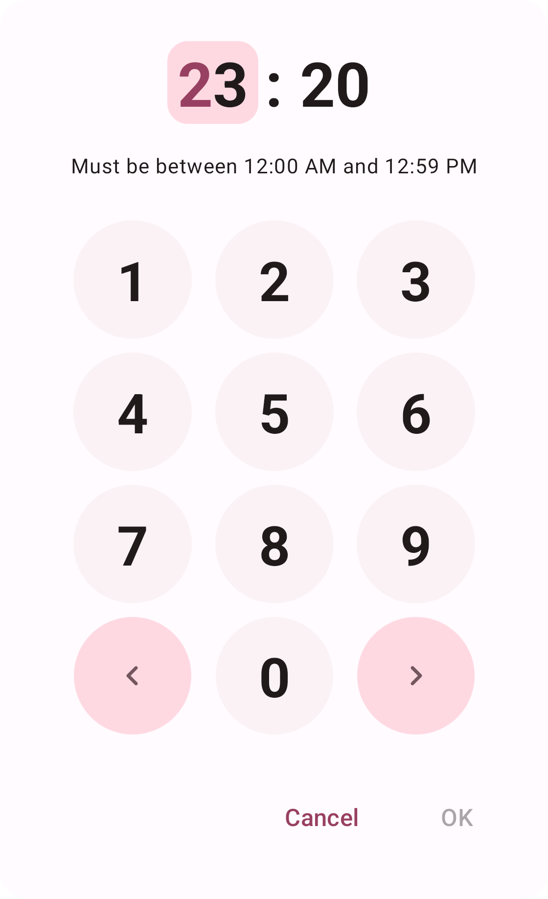</td>
<td width="25%"> <a href="https://github.com/maxkeppeler/sheets-compose-dialogs/blob/main/app/src/main/java/com/mk/sheets/compose/samples/ClockSample1.kt" title="Code">ClockSample1</a>
 </br>
</td>
<td width="25%"> </td>
<td width="25%"> </td>
</tr>
<tr>
<td width="25%"> <a style="text-align: center" href="https://github.com/maxkeppeler/sheets-compose-dialogs/blob/main/app/src/main/java/com/mk/sheets/compose/samples/ClockSample2.kt" title="Code">ClockSample2</a>
 </br>
 </td>
<td width="25%"> <a href="https://github.com/maxkeppeler/sheets-compose-dialogs/blob/main/app/src/main/java/com/mk/sheets/compose/samples/ClockSample2.kt" title="Code">ClockSample2</a>
 </br>
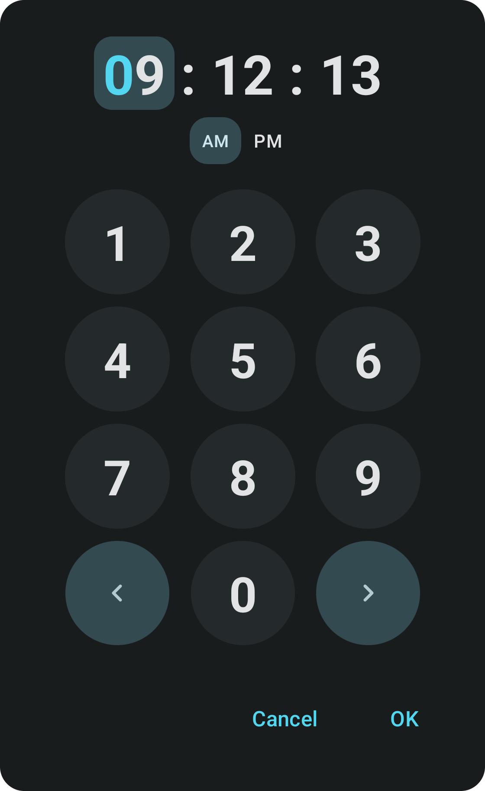</td>
<td width="25%"> </td>
<td width="25%"> </td>
</tr>
</table>
</br>


<h2>Color</h2>
Module <code>color</code> ‎‎ | ‎‎ <a href="https://maxkeppeler.github.io/sheets-compose-dialogs/api/color/index.html" title="Module Documentation">API Documentation</a>
</br>
</br>
<table style="border: none;">
<tr>
<th style="text-align: center;">Light</th>
<th style="text-align: center;">Dark</th>
<th style="text-align: center;"></th>
<th style="text-align: center;"></th>
</tr>
<tr>
<td width="25%"> <a style="text-align: center" href="https://github.com/maxkeppeler/sheets-compose-dialogs/blob/main/app/src/main/java/com/mk/sheets/compose/samples/ColorSample1.kt" title="Code">ColorSample1</a>
 </br>
 </td>
<td width="25%"> <a href="https://github.com/maxkeppeler/sheets-compose-dialogs/blob/main/app/src/main/java/com/mk/sheets/compose/samples/ColorSample1.kt" title="Code">ColorSample1</a>
 </br>
</td>
<td width="25%"> </td>
<td width="25%"> </td>
</tr>
<tr>
<td width="25%"> <a style="text-align: center" href="https://github.com/maxkeppeler/sheets-compose-dialogs/blob/main/app/src/main/java/com/mk/sheets/compose/samples/ColorSample2.kt" title="Code">ColorSample2</a>
 </br>
 </td>
<td width="25%"> <a href="https://github.com/maxkeppeler/sheets-compose-dialogs/blob/main/app/src/main/java/com/mk/sheets/compose/samples/ColorSample2.kt" title="Code">ColorSample2</a>
 </br>
</td>
<td width="25%"> </td>
<td width="25%"> </td>
</tr>
<tr>
<td width="25%"> <a style="text-align: center" href="https://github.com/maxkeppeler/sheets-compose-dialogs/blob/main/app/src/main/java/com/mk/sheets/compose/samples/ColorSample3.kt" title="Code">ColorSample3</a>
 </br>
 </td>
<td width="25%"> <a href="https://github.com/maxkeppeler/sheets-compose-dialogs/blob/main/app/src/main/java/com/mk/sheets/compose/samples/ColorSample3.kt" title="Code">ColorSample3</a>
 </br>
</td>
<td width="25%"> </td>
<td width="25%"> </td>
</tr>
</table>
</br>


<h2>Core</h2>
Module <code>core</code> ‎‎ | ‎‎ <a href="https://maxkeppeler.github.io/sheets-compose-dialogs/api/core/index.html" title="Module Documentation">API Documentation</a>
</br>
</br>
<table style="border: none;">
<tr>
<th style="text-align: center;">Light</th>
<th style="text-align: center;">Dark</th>
<th style="text-align: center;"></th>
<th style="text-align: center;"></th>
</tr>
<tr>
<td width="25%"> <a style="text-align: center" href="https://github.com/maxkeppeler/sheets-compose-dialogs/blob/main/app/src/main/java/com/mk/sheets/compose/samples/CoreSample1.kt" title="Code">CoreSample1</a>
 </br>
 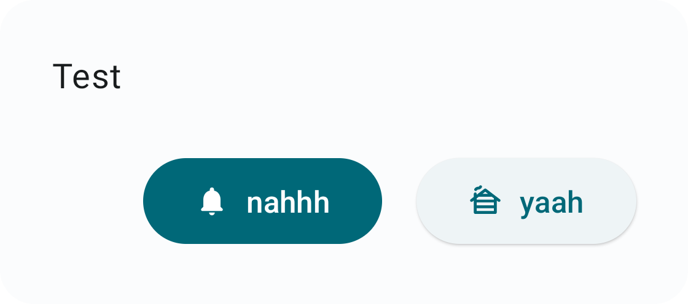</td>
<td width="25%"> <a href="https://github.com/maxkeppeler/sheets-compose-dialogs/blob/main/app/src/main/java/com/mk/sheets/compose/samples/CoreSample1.kt" title="Code">CoreSample1</a>
 </br>
</td>
<td width="25%"> </td>
<td width="25%"> </td>
</tr>
</table>
</br>


<h2>Date-Time</h2>
Module <code>date-time</code> ‎‎ | ‎‎ <a href="https://maxkeppeler.github.io/sheets-compose-dialogs/api/date_time/index.html" title="Module Documentation">API Documentation</a>
</br>
</br>
<table style="border: none;">
<tr>
<th style="text-align: center;">Light</th>
<th style="text-align: center;">Dark</th>
<th style="text-align: center;"></th>
<th style="text-align: center;"></th>
</tr>
<tr>
<td width="25%"> <a style="text-align: center" href="https://github.com/maxkeppeler/sheets-compose-dialogs/blob/main/app/src/main/java/com/mk/sheets/compose/samples/DateTimeSample1.kt" title="Code">DateTimeSample1</a>
 </br>
 </td>
<td width="25%"> <a href="https://github.com/maxkeppeler/sheets-compose-dialogs/blob/main/app/src/main/java/com/mk/sheets/compose/samples/DateTimeSample1.kt" title="Code">DateTimeSample1</a>
 </br>
</td>
<td width="25%"> </td>
<td width="25%"> </td>
</tr>
<tr>
<td width="25%"> <a style="text-align: center" href="https://github.com/maxkeppeler/sheets-compose-dialogs/blob/main/app/src/main/java/com/mk/sheets/compose/samples/DateTimeSample2.kt" title="Code">DateTimeSample2</a>
 </br>
 </td>
<td width="25%"> <a href="https://github.com/maxkeppeler/sheets-compose-dialogs/blob/main/app/src/main/java/com/mk/sheets/compose/samples/DateTimeSample2.kt" title="Code">DateTimeSample2</a>
 </br>
</td>
<td width="25%"> </td>
<td width="25%"> </td>
</tr>
<tr>
<td width="25%"> <a style="text-align: center" href="https://github.com/maxkeppeler/sheets-compose-dialogs/blob/main/app/src/main/java/com/mk/sheets/compose/samples/DateTimeSample3.kt" title="Code">DateTimeSample3</a>
 </br>
 </td>
<td width="25%"> <a href="https://github.com/maxkeppeler/sheets-compose-dialogs/blob/main/app/src/main/java/com/mk/sheets/compose/samples/DateTimeSample3.kt" title="Code">DateTimeSample3</a>
 </br>
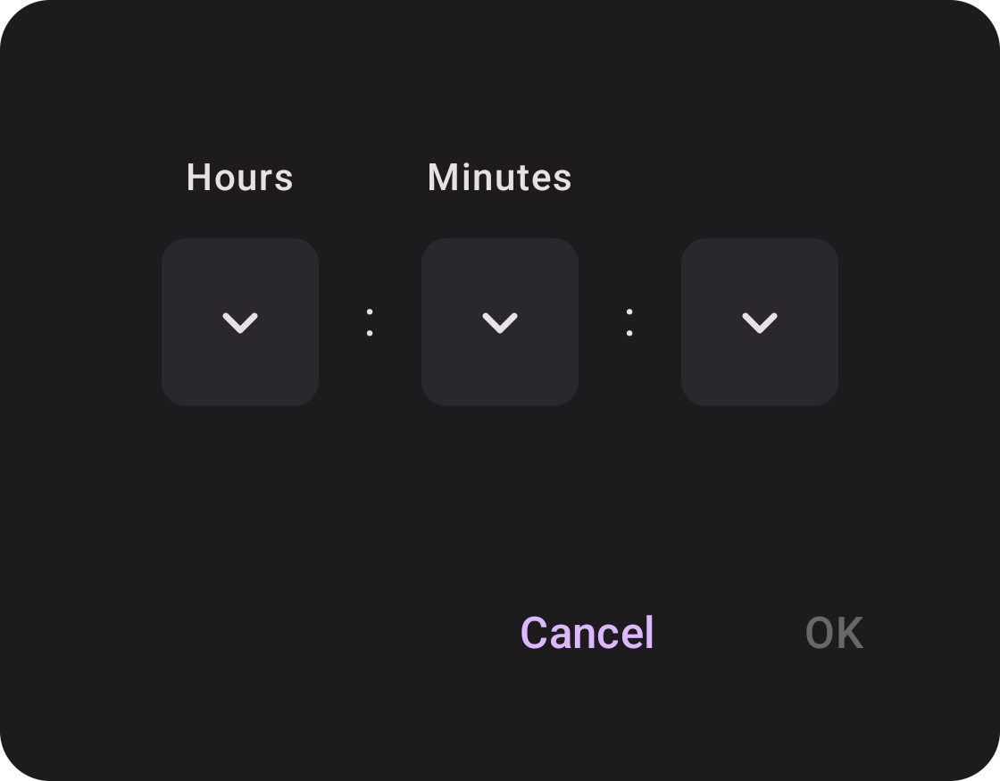</td>
<td width="25%"> </td>
<td width="25%"> </td>
</tr>
</table>
</br>


<h2>Duration</h2>
Module <code>duration</code> ‎‎ | ‎‎ <a href="https://maxkeppeler.github.io/sheets-compose-dialogs/api/duration/index.html" title="Module Documentation">API Documentation</a>
</br>
</br>
<table style="border: none;">
<tr>
<th style="text-align: center;">Light</th>
<th style="text-align: center;">Dark</th>
<th style="text-align: center;"></th>
<th style="text-align: center;"></th>
</tr>
<tr>
<td width="25%"> <a style="text-align: center" href="https://github.com/maxkeppeler/sheets-compose-dialogs/blob/main/app/src/main/java/com/mk/sheets/compose/samples/DurationSample1.kt" title="Code">DurationSample1</a>
 </br>
 </td>
<td width="25%"> <a href="https://github.com/maxkeppeler/sheets-compose-dialogs/blob/main/app/src/main/java/com/mk/sheets/compose/samples/DurationSample1.kt" title="Code">DurationSample1</a>
 </br>
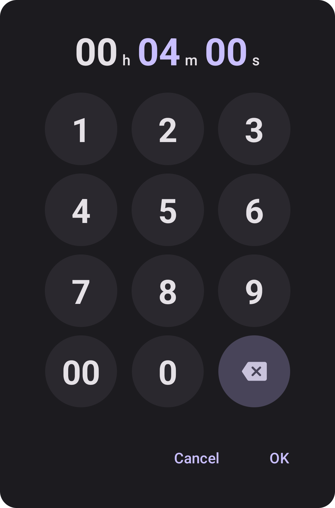</td>
<td width="25%"> </td>
<td width="25%"> </td>
</tr>
<tr>
<td width="25%"> <a style="text-align: center" href="https://github.com/maxkeppeler/sheets-compose-dialogs/blob/main/app/src/main/java/com/mk/sheets/compose/samples/DurationSample2.kt" title="Code">DurationSample2</a>
 </br>
 </td>
<td width="25%"> <a href="https://github.com/maxkeppeler/sheets-compose-dialogs/blob/main/app/src/main/java/com/mk/sheets/compose/samples/DurationSample2.kt" title="Code">DurationSample2</a>
 </br>
</td>
<td width="25%"> </td>
<td width="25%"> </td>
</tr>
</table>
</br>


<h2>Emoji</h2>
Module <code>emoji</code> ‎‎ | ‎‎ <a href="https://maxkeppeler.github.io/sheets-compose-dialogs/api/emoji/index.html" title="Module Documentation">API Documentation</a>
</br>
</br>
<table style="border: none;">
<tr>
<th style="text-align: center;">Light</th>
<th style="text-align: center;">Dark</th>
<th style="text-align: center;"></th>
<th style="text-align: center;"></th>
</tr>
<tr>
<td width="25%"> <a style="text-align: center" href="https://github.com/maxkeppeler/sheets-compose-dialogs/blob/main/app/src/main/java/com/mk/sheets/compose/samples/EmojiSample1.kt" title="Code">EmojiSample1</a>
 </br>
 </td>
<td width="25%"> <a href="https://github.com/maxkeppeler/sheets-compose-dialogs/blob/main/app/src/main/java/com/mk/sheets/compose/samples/EmojiSample1.kt" title="Code">EmojiSample1</a>
 </br>
</td>
<td width="25%"> </td>
<td width="25%"> </td>
</tr>
<tr>
<td width="25%"> <a style="text-align: center" href="https://github.com/maxkeppeler/sheets-compose-dialogs/blob/main/app/src/main/java/com/mk/sheets/compose/samples/EmojiSample2.kt" title="Code">EmojiSample2</a>
 </br>
 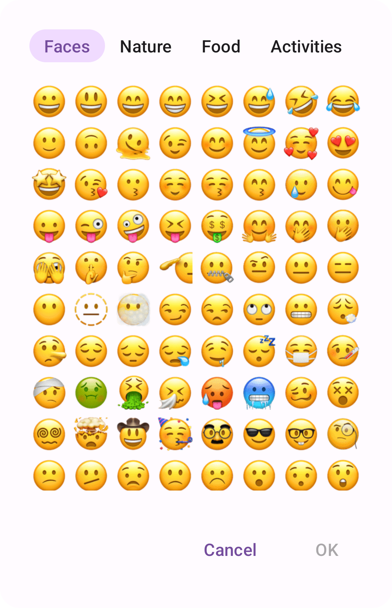</td>
<td width="25%"> <a href="https://github.com/maxkeppeler/sheets-compose-dialogs/blob/main/app/src/main/java/com/mk/sheets/compose/samples/EmojiSample2.kt" title="Code">EmojiSample2</a>
 </br>
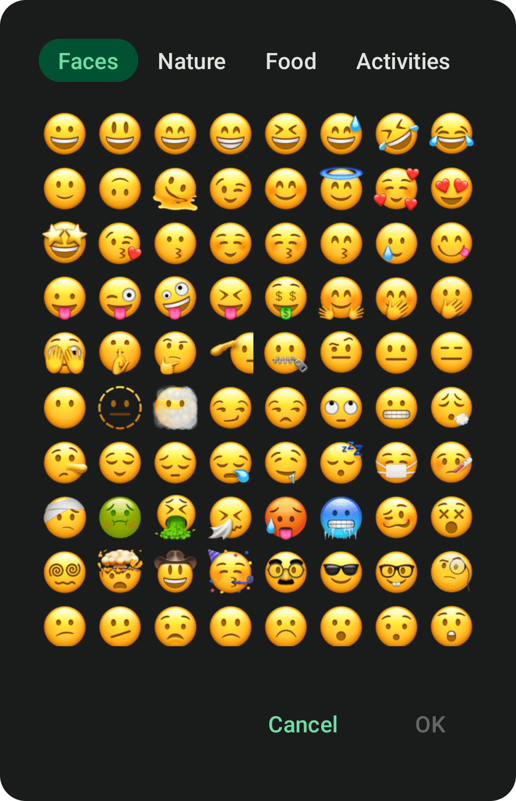</td>
<td width="25%"> </td>
<td width="25%"> </td>
</tr>
</table>
</br>


<h2>Info</h2>
Module <code>info</code> ‎‎ | ‎‎ <a href="https://maxkeppeler.github.io/sheets-compose-dialogs/api/info/index.html" title="Module Documentation">API Documentation</a>
</br>
</br>
<table style="border: none;">
<tr>
<th style="text-align: center;">Light</th>
<th style="text-align: center;">Dark</th>
<th style="text-align: center;"></th>
<th style="text-align: center;"></th>
</tr>
<tr>
<td width="25%"> <a style="text-align: center" href="https://github.com/maxkeppeler/sheets-compose-dialogs/blob/main/app/src/main/java/com/mk/sheets/compose/samples/InfoSample1.kt" title="Code">InfoSample1</a>
 </br>
 </td>
<td width="25%"> <a href="https://github.com/maxkeppeler/sheets-compose-dialogs/blob/main/app/src/main/java/com/mk/sheets/compose/samples/InfoSample1.kt" title="Code">InfoSample1</a>
 </br>
</td>
<td width="25%"> </td>
<td width="25%"> </td>
</tr>
</table>
</br>


<h2>Input</h2>
Module <code>input</code> ‎‎ | ‎‎ <a href="https://maxkeppeler.github.io/sheets-compose-dialogs/api/input/index.html" title="Module Documentation">API Documentation</a>
</br>
</br>
<table style="border: none;">
<tr>
<th style="text-align: center;">Light</th>
<th style="text-align: center;">Dark</th>
<th style="text-align: center;"></th>
<th style="text-align: center;"></th>
</tr>
<tr>
<td width="25%"> <a style="text-align: center" href="https://github.com/maxkeppeler/sheets-compose-dialogs/blob/main/app/src/main/java/com/mk/sheets/compose/samples/InputSample1.kt" title="Code">InputSample1</a>
 </br>
 </td>
<td width="25%"> <a href="https://github.com/maxkeppeler/sheets-compose-dialogs/blob/main/app/src/main/java/com/mk/sheets/compose/samples/InputSample1.kt" title="Code">InputSample1</a>
 </br>
</td>
<td width="25%"> </td>
<td width="25%"> </td>
</tr>
<tr>
<td width="25%"> <a style="text-align: center" href="https://github.com/maxkeppeler/sheets-compose-dialogs/blob/main/app/src/main/java/com/mk/sheets/compose/samples/InputSample2.kt" title="Code">InputSample2</a>
 </br>
 </td>
<td width="25%"> <a href="https://github.com/maxkeppeler/sheets-compose-dialogs/blob/main/app/src/main/java/com/mk/sheets/compose/samples/InputSample2.kt" title="Code">InputSample2</a>
 </br>
</td>
<td width="25%"> </td>
<td width="25%"> </td>
</tr>
<tr>
<td width="25%"> <a style="text-align: center" href="https://github.com/maxkeppeler/sheets-compose-dialogs/blob/main/app/src/main/java/com/mk/sheets/compose/samples/InputSample3.kt" title="Code">InputSample3</a>
 </br>
 </td>
<td width="25%"> <a href="https://github.com/maxkeppeler/sheets-compose-dialogs/blob/main/app/src/main/java/com/mk/sheets/compose/samples/InputSample3.kt" title="Code">InputSample3</a>
 </br>
</td>
<td width="25%"> </td>
<td width="25%"> </td>
</tr>
<tr>
<td width="25%"> <a style="text-align: center" href="https://github.com/maxkeppeler/sheets-compose-dialogs/blob/main/app/src/main/java/com/mk/sheets/compose/samples/InputSample4.kt" title="Code">InputSample4</a>
 </br>
 </td>
<td width="25%"> <a href="https://github.com/maxkeppeler/sheets-compose-dialogs/blob/main/app/src/main/java/com/mk/sheets/compose/samples/InputSample4.kt" title="Code">InputSample4</a>
 </br>
</td>
<td width="25%"> </td>
<td width="25%"> </td>
</tr>
</table>
</br>


<h2>List</h2>
Module <code>list</code> ‎‎ | ‎‎ <a href="https://maxkeppeler.github.io/sheets-compose-dialogs/api/list/index.html" title="Module Documentation">API Documentation</a>
</br>
</br>
<table style="border: none;">
<tr>
<th style="text-align: center;">Light</th>
<th style="text-align: center;">Dark</th>
<th style="text-align: center;"></th>
<th style="text-align: center;"></th>
</tr>
<tr>
<td width="25%"> <a style="text-align: center" href="https://github.com/maxkeppeler/sheets-compose-dialogs/blob/main/app/src/main/java/com/mk/sheets/compose/samples/ListSample1.kt" title="Code">ListSample1</a>
 </br>
 </td>
<td width="25%"> <a href="https://github.com/maxkeppeler/sheets-compose-dialogs/blob/main/app/src/main/java/com/mk/sheets/compose/samples/ListSample1.kt" title="Code">ListSample1</a>
 </br>
</td>
<td width="25%"> </td>
<td width="25%"> </td>
</tr>
<tr>
<td width="25%"> <a style="text-align: center" href="https://github.com/maxkeppeler/sheets-compose-dialogs/blob/main/app/src/main/java/com/mk/sheets/compose/samples/ListSample2.kt" title="Code">ListSample2</a>
 </br>
 </td>
<td width="25%"> <a href="https://github.com/maxkeppeler/sheets-compose-dialogs/blob/main/app/src/main/java/com/mk/sheets/compose/samples/ListSample2.kt" title="Code">ListSample2</a>
 </br>
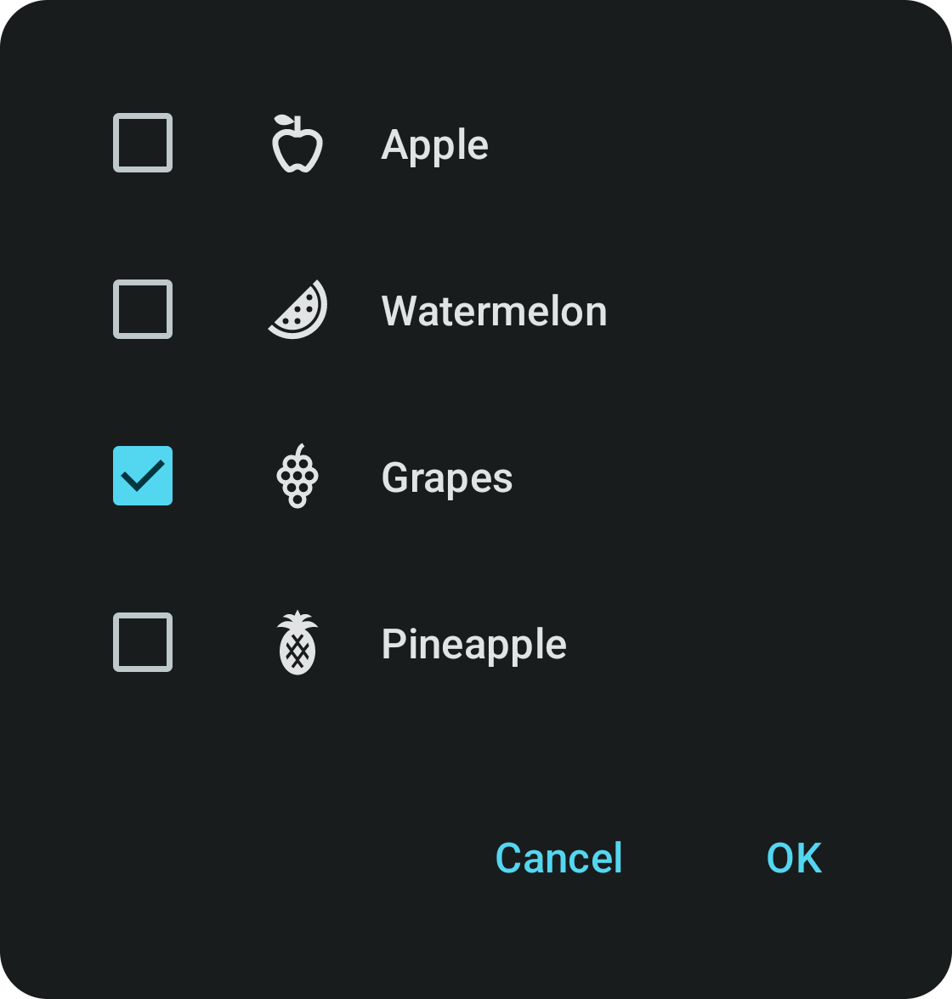</td>
<td width="25%"> </td>
<td width="25%"> </td>
</tr>
<tr>
<td width="25%"> <a style="text-align: center" href="https://github.com/maxkeppeler/sheets-compose-dialogs/blob/main/app/src/main/java/com/mk/sheets/compose/samples/ListSample3.kt" title="Code">ListSample3</a>
 </br>
 </td>
<td width="25%"> <a href="https://github.com/maxkeppeler/sheets-compose-dialogs/blob/main/app/src/main/java/com/mk/sheets/compose/samples/ListSample3.kt" title="Code">ListSample3</a>
 </br>
</td>
<td width="25%"> </td>
<td width="25%"> </td>
</tr>
<tr>
<td width="25%"> <a style="text-align: center" href="https://github.com/maxkeppeler/sheets-compose-dialogs/blob/main/app/src/main/java/com/mk/sheets/compose/samples/ListSample4.kt" title="Code">ListSample4</a>
 </br>
 </td>
<td width="25%"> <a href="https://github.com/maxkeppeler/sheets-compose-dialogs/blob/main/app/src/main/java/com/mk/sheets/compose/samples/ListSample4.kt" title="Code">ListSample4</a>
 </br>
</td>
<td width="25%"> </td>
<td width="25%"> </td>
</tr>
</table>
</br>


<h2>Option</h2>
Module <code>option</code> ‎‎ | ‎‎ <a href="https://maxkeppeler.github.io/sheets-compose-dialogs/api/option/index.html" title="Module Documentation">API Documentation</a>
</br>
</br>
<table style="border: none;">
<tr>
<th style="text-align: center;">Light</th>
<th style="text-align: center;">Dark</th>
<th style="text-align: center;"></th>
<th style="text-align: center;"></th>
</tr>
<tr>
<td width="25%"> <a style="text-align: center" href="https://github.com/maxkeppeler/sheets-compose-dialogs/blob/main/app/src/main/java/com/mk/sheets/compose/samples/OptionSample1.kt" title="Code">OptionSample1</a>
 </br>
 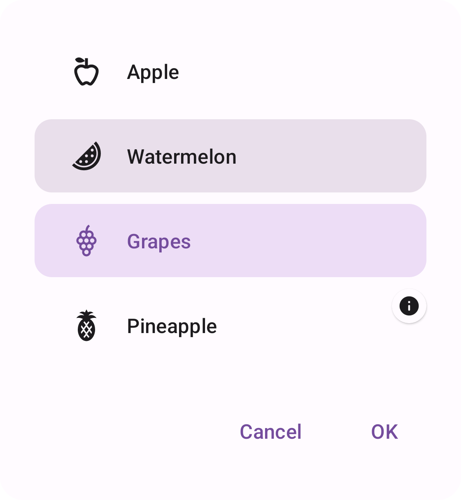</td>
<td width="25%"> <a href="https://github.com/maxkeppeler/sheets-compose-dialogs/blob/main/app/src/main/java/com/mk/sheets/compose/samples/OptionSample1.kt" title="Code">OptionSample1</a>
 </br>
</td>
<td width="25%"> </td>
<td width="25%"> </td>
</tr>
<tr>
<td width="25%"> <a style="text-align: center" href="https://github.com/maxkeppeler/sheets-compose-dialogs/blob/main/app/src/main/java/com/mk/sheets/compose/samples/OptionSample2.kt" title="Code">OptionSample2</a>
 </br>
 </td>
<td width="25%"> <a href="https://github.com/maxkeppeler/sheets-compose-dialogs/blob/main/app/src/main/java/com/mk/sheets/compose/samples/OptionSample2.kt" title="Code">OptionSample2</a>
 </br>
</td>
<td width="25%"> </td>
<td width="25%"> </td>
</tr>
<tr>
<td width="25%"> <a style="text-align: center" href="https://github.com/maxkeppeler/sheets-compose-dialogs/blob/main/app/src/main/java/com/mk/sheets/compose/samples/OptionSample3.kt" title="Code">OptionSample3</a>
 </br>
 </td>
<td width="25%"> <a href="https://github.com/maxkeppeler/sheets-compose-dialogs/blob/main/app/src/main/java/com/mk/sheets/compose/samples/OptionSample3.kt" title="Code">OptionSample3</a>
 </br>
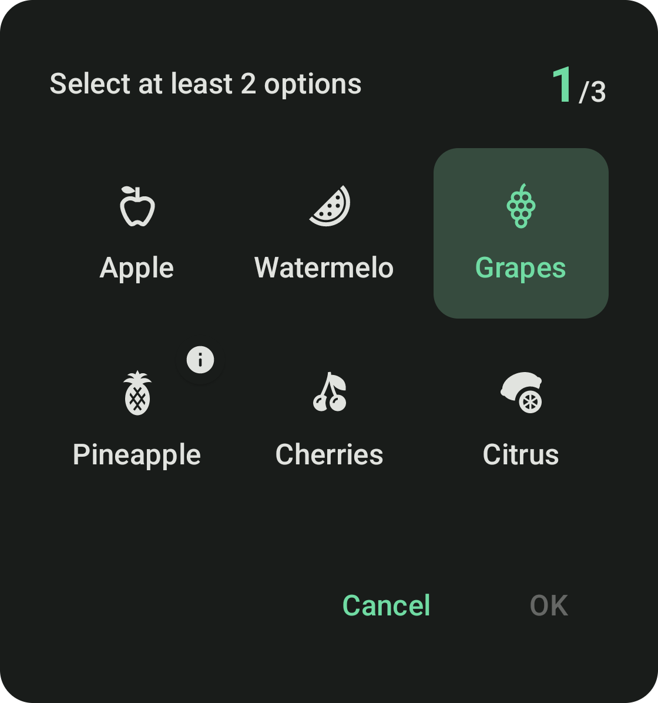</td>
<td width="25%"> </td>
<td width="25%"> </td>
</tr>
</table>
</br>


<h2>State</h2>
Module <code>state</code> ‎‎ | ‎‎ <a href="https://maxkeppeler.github.io/sheets-compose-dialogs/api/state/index.html" title="Module Documentation">API Documentation</a>
</br>
</br>
<table style="border: none;">
<tr>
<th style="text-align: center;">Light</th>
<th style="text-align: center;">Dark</th>
<th style="text-align: center;"></th>
<th style="text-align: center;"></th>
</tr>
<tr>
<td width="25%"> <a style="text-align: center" href="https://github.com/maxkeppeler/sheets-compose-dialogs/blob/main/app/src/main/java/com/mk/sheets/compose/samples/StateSample1.kt" title="Code">StateSample1</a>
 </br>
 </td>
<td width="25%"> <a href="https://github.com/maxkeppeler/sheets-compose-dialogs/blob/main/app/src/main/java/com/mk/sheets/compose/samples/StateSample1.kt" title="Code">StateSample1</a>
 </br>
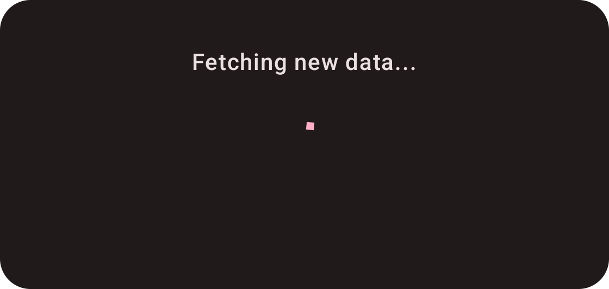</td>
<td width="25%"> </td>
<td width="25%"> </td>
</tr>
<tr>
<td width="25%"> <a style="text-align: center" href="https://github.com/maxkeppeler/sheets-compose-dialogs/blob/main/app/src/main/java/com/mk/sheets/compose/samples/StateSample2.kt" title="Code">StateSample2</a>
 </br>
 </td>
<td width="25%"> <a href="https://github.com/maxkeppeler/sheets-compose-dialogs/blob/main/app/src/main/java/com/mk/sheets/compose/samples/StateSample2.kt" title="Code">StateSample2</a>
 </br>
</td>
<td width="25%"> </td>
<td width="25%"> </td>
</tr>
<tr>
<td width="25%"> <a style="text-align: center" href="https://github.com/maxkeppeler/sheets-compose-dialogs/blob/main/app/src/main/java/com/mk/sheets/compose/samples/StateSample3.kt" title="Code">StateSample3</a>
 </br>
 </td>
<td width="25%"> <a href="https://github.com/maxkeppeler/sheets-compose-dialogs/blob/main/app/src/main/java/com/mk/sheets/compose/samples/StateSample3.kt" title="Code">StateSample3</a>
 </br>
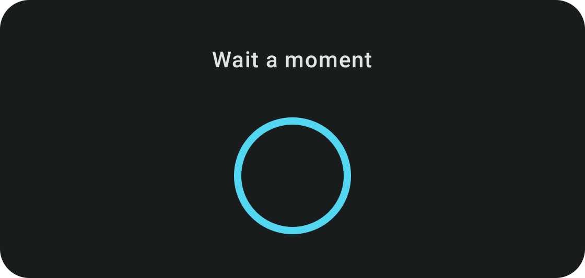</td>
<td width="25%"> </td>
<td width="25%"> </td>
</tr>
<tr>
<td width="25%"> <a style="text-align: center" href="https://github.com/maxkeppeler/sheets-compose-dialogs/blob/main/app/src/main/java/com/mk/sheets/compose/samples/StateSample4.kt" title="Code">StateSample4</a>
 </br>
 </td>
<td width="25%"> <a href="https://github.com/maxkeppeler/sheets-compose-dialogs/blob/main/app/src/main/java/com/mk/sheets/compose/samples/StateSample4.kt" title="Code">StateSample4</a>
 </br>
</td>
<td width="25%"> </td>
<td width="25%"> </td>
</tr>
<tr>
<td width="25%"> <a style="text-align: center" href="https://github.com/maxkeppeler/sheets-compose-dialogs/blob/main/app/src/main/java/com/mk/sheets/compose/samples/StateSample5.kt" title="Code">StateSample5</a>
 </br>
 </td>
<td width="25%"> <a href="https://github.com/maxkeppeler/sheets-compose-dialogs/blob/main/app/src/main/java/com/mk/sheets/compose/samples/StateSample5.kt" title="Code">StateSample5</a>
 </br>
</td>
<td width="25%"> </td>
<td width="25%"> </td>
</tr>
<tr>
<td width="25%"> <a style="text-align: center" href="https://github.com/maxkeppeler/sheets-compose-dialogs/blob/main/app/src/main/java/com/mk/sheets/compose/samples/StateSample6.kt" title="Code">StateSample6</a>
 </br>
 </td>
<td width="25%"> <a href="https://github.com/maxkeppeler/sheets-compose-dialogs/blob/main/app/src/main/java/com/mk/sheets/compose/samples/StateSample6.kt" title="Code">StateSample6</a>
 </br>
</td>
<td width="25%"> </td>
<td width="25%"> </td>
</tr>
<tr>
<td width="25%"> <a style="text-align: center" href="https://github.com/maxkeppeler/sheets-compose-dialogs/blob/main/app/src/main/java/com/mk/sheets/compose/samples/StateSample7.kt" title="Code">StateSample7</a>
 </br>
 </td>
<td width="25%"> <a href="https://github.com/maxkeppeler/sheets-compose-dialogs/blob/main/app/src/main/java/com/mk/sheets/compose/samples/StateSample7.kt" title="Code">StateSample7</a>
 </br>
</td>
<td width="25%"> </td>
<td width="25%"> </td>
</tr>
</table>
</br>


<!-- AUTO-GENERATED-SAMPLES-CONTENT:END -->

## Donate

Show your appreciation by donating me a coffee. Thank you very much!

<a href="https://ko-fi.com/maxkeppeler" target='_blank'>
 
</a>

<a href="https://www.buymeacoffee.com/maxkeppeler" target="_blank">
    
</a>

<a href="https://www.paypal.me/maximiliankeppeler" target="_blank">
    
</a>

## Showcase

Check out some apps which are using this library.<br/>
- [Elcovia - Notion Templates & Resources](https://play.google.com/store/apps/details?id=com.elcovia.android)
- [WearSocials](https://play.google.com/store/apps/details?id=com.mk.wearsocials)
- [Respawn](https://play.google.com/store/apps/details?id=com.nek12.respawn)
- [Mangata (Soon)](http://mangata-mk.com)

## License

    Copyright 2022-2023 Maximilian Keppeler https://maxkeppeler.com

    Licensed under the Apache License, Version 2.0 (the "License");
    you may not use this file except in compliance with the License.
    You may obtain a copy of the License at

       http://www.apache.org/licenses/LICENSE-2.0

    Unless required by applicable law or agreed to in writing, software
    distributed under the License is distributed on an "AS IS" BASIS,
    WITHOUT WARRANTIES OR CONDITIONS OF ANY KIND, either express or implied.
    See the License for the specific language governing permissions and
    limitations under the License.
